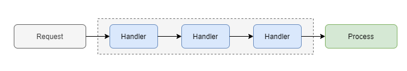
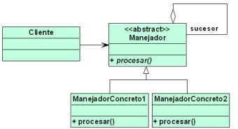
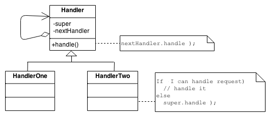
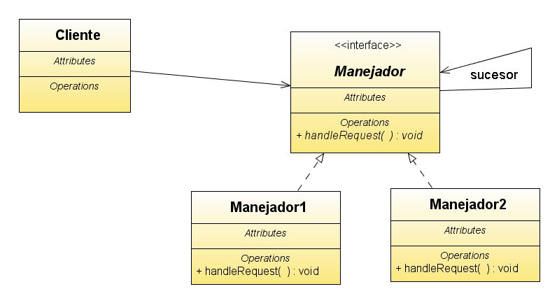

#ChainOfResponsability

##Definición
La cadena de responsabilidad es un patrón de diseño de comportamiento que
le permite pasar solicitudes a lo largo de una cadena de manejadores 
(handlers).
Al recibir una solicitud, cada handler decide procesarla o pasarla
al siguiente handler de la cadena.

Este patrón puede resultarnos útil en casos en los que un objeto emisor
de una petición desconozca qué objeto(s) podrá(n) atender a la misma.

##El problema

Cuando hay comunicación entre 2 objetos, normalmente estos se acoplan
mediante una conexión. Pretendemos desacoplar el sistema, pero nuestro 
problema es que el receptor del mensaje no va a conocer directamente
el origen del mismo. El patrón Chain of Resbonsability trata de resolver 
esta situación.

Se aplica cuando:

- Varios objetos pueden manejar cierta petición, y el handler no se 
conoce a priori, sino que debería determinarse automáticamente.
- Pretendemos enviar un mensaje a un objeto entre varios sin especificar
explícitamente el receptor.
- Los objetos que pueden tratar el mensaje deberían ser especificados 
dinámicamente.

##La solución

Para solucionar este problema debemos encontrar un mecanismo mediante 
el cual pasar mensajes a través la cadena de objetos, para que si el que 
lo recibe no sabe procesarlo lo pase a otro objeto.

Para lograr esto, crearemos una **_interfaz Handler_** que permite tratar 
las peticiones en general. Crearemos también algunos _**handlers concretos**_ 
que son los que se encargan de procesar una petición concreta. 
El cliente que desea enviar el mensaje pasará el mismo a un handler 
concreto, que se encargará o bien de procesarlo o bien de transferirlo a 
otros objetos que pertenezcan a la cadena.

Todos los objetos receptores implementarán la misma interfaz o 
extenderán la misma clase abstracta. En ambos casos se proveerá de un 
método que permita obtener el _**sucesor**_ y así el paso de la petición 
por la cadena será lo más flexible y transparente posible.

##Una analogía en el Real World

Ejemplos de uso: el patrón Cadena de responsabilidad no es un invitado 
frecuente en un programa Java, ya que solo es relevante cuando el código
opera con cadenas de objetos.

- Uno de los casos de uso más populares para el patrón es enviar eventos
a los componentes principales en las clases de GUI (interfaz gráfica 
de usuario).

- Otro caso de uso son los filtros de acceso secuencial.

##Ventajas / Inconvenientes

####VENTAJAS:

- Puede controlar el orden de gestión de solicitudes.

- _Principio de responsabilidad única_. Puede desacoplar las clases que
invocan operaciones de las clases que realizan operaciones.
Elimina o reduce el acoplamiento existente entre el emisor y el receptor
del mensaje.

- _Principio abierto/cerrado_. Puede introducir nuevos controladores en 
la aplicación sin romper el código de cliente existente.

####DESVENTAJAS:

- No garantiza la recepción (algunas solicitudes pueden terminar 
sin ser atendidas).

##Ejercicio
	😵‍💫

Escenario: estamos realizando el software para un banco y uno de los puntos 
más importantes es saber quién puede aprobar un crédito. 
Por lo tanto el banco define las siguientes reglas de negocio:

- Si el monto no supera los $ 10.000 entonces el ejecutivo de cuenta pueda 
aprobar el préstamo.
- Si el monto esta entre los $10.000 y $50.000 entonces la persona indicada
para realizar la aprobación es el líder inmediato de dicho ejecutivo.
- Si el monto se encuentra entre $ 50.000 y $100.000 entonces es el Gerente 
quién debe realizar dicha aprobación.
- Por montos superiores a los $100.000 entonces la aprobación la realizará 
el Director.

Para este caso se ha decidido realizar un patrón Chain of Responsibility. 
Se decide crear una interface llamada IAprobador que debe implementar toda 
clase que pertenezca a nuestra cadena de responsabilidades.

##UML

_Manejador_: Interfaz que define las operaciones necesarias para tratar 
los mensajes y propagarlos si corresponde.

_ManejadorConcreto_: Implementa la interfaz Manejador. Se encarga de 
procesar un tipo de mensaje concreto o propagar el mensaje a otro 
miembro de la cadena en caso de que el mensaje no sea de dicho tipo.

_Client_: Trata de enviar un mensaje a un destino propagándolo mediante 
un Manejador conocido.

##Links de interés

https://refactoring.guru/design-patterns/chain-of-responsibility

https://informaticapc.com/patrones-de-diseno/chain-of-responsability.php

https://programacion.net/articulo/patrones_de_diseno_xiv_patrones_de_comportamiento_chain_of_responsability_1017

https://medium.com/@disenotec2016/chain-of-responsibility-cadena-de-responsabilidad-104ae0bf6dfa