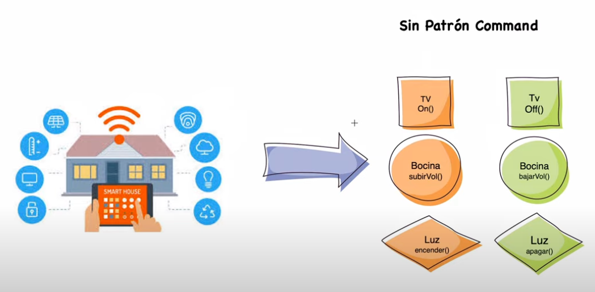
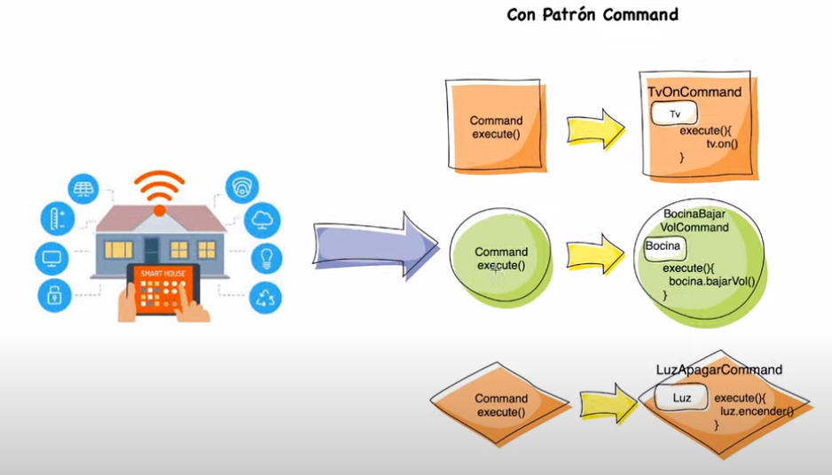
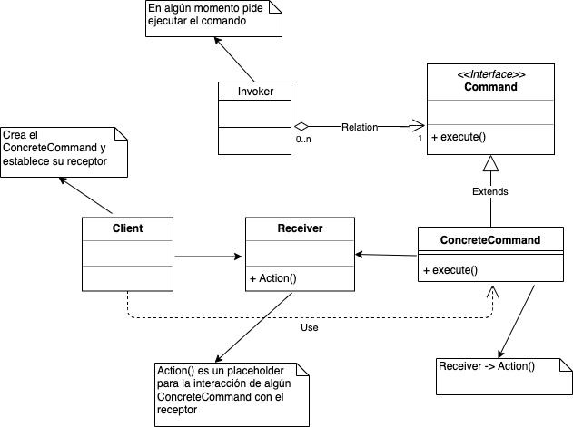

## Command 🔎

Convierte una solicitud en un objeto independiente que contiene toda la información sobre la solicitud. Esta transformación permite parametrizar métodos con diferentes solicitudes, retrasar o poner en cola la ejecución de una solicitud y respaldar operaciones que no se pueden deshacer.

Nos permite solicitar operaciones a objetos sin conocer realmente el contenido de éstas.

### El Problema 🤨

Un simple programa puede ejecutar decenas de invocaciones a subprocesos o subprogramas. En ocasiones es muy conveniente desacoplar la invocación de determinados procesos del contexto donde se encuentran, y ésto es precisamente el problema que viene a solucionar el patrón Command.

Además pueden surgir situaciones en las que las invocaciones deban de tratarse por medio de una cola, pila o estructura de datos similar. Mediante el patrón Command podemos realizar estas acciones de manera sencilla.

#### Se Aplica cuando:

- Precisamos de colas, pilas u otras estructuras para gestionar las invocaciones.
- Exista la posibilidad de cancelar operaciones.
- Se necesite parametrizar de manera uniforme las invocaciones.
- El momento de ejecución del subprograma o subproceso deba de ser independiente del contexto en el que se invoca.
- Necesitemos realizar llamadas a órdenes cuyos parámetros puedan ser otras órdenes (callbacks).
- Las órdenes que debemos desarrollar son de alto nivel y por debajo son implementadas por órdenes simples (primitivas).

 
  
  

### La solución 🤓

La solución consiste en crear una interfaz Command que contenga un método execute, permitiendo desde la misma ejecutar la operación a la que representa el comando. Adicionalmente, si se permite deshacer operaciones, deberemos añadir un método undo para poder hacerlo.

### UML 🗓

 
  

### Consecuencias 🌝

#### Positivas

- Desacoplamiento de la aplicación que invoca las órdenes y la implementación de las mismas.
- Como las órdenes son objetos, podemos aplicar la herencia a las mismas o realizar composiciones de órdenes.
- El conjunto de órdenes es escalable.
- Permite modificar las órdenes a ejecutar en tiempo de ejecución.

#### Negativas

- Aumenta el volumen de nuestro código.

### Links de interés 📚

- https://refactoring.guru/es/design-patterns/behavioral-patterns
- https://programacion.net/articulo/patrones_de_diseno_xv_patrones_de_comportamiento_command_1018
- https://github.com/mrugerio/myHelloWorldJava