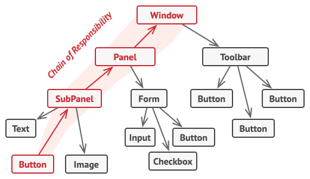
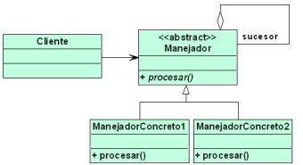
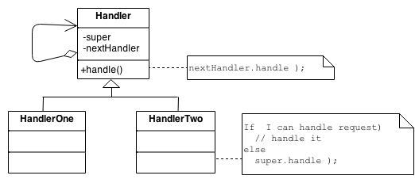
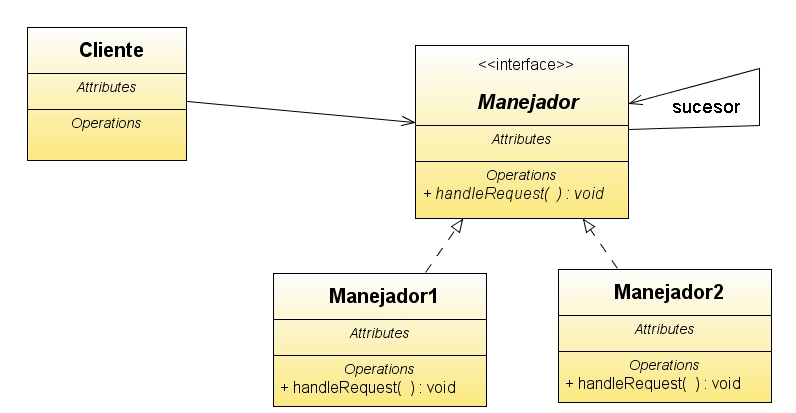

#ChainOfResponsability

##Definición
La cadena de responsabilidad es un patrón de diseño de comportamiento que
le permite pasar solicitudes a lo largo de una cadena de manejadores 
(handlers).
Al recibir una solicitud, cada handler decide procesarla o pasarla
al siguiente handler de la cadena.

Este patrón puede resultarnos útil en casos en los que un objeto emisor
de una petición desconozca qué objeto(s) podrá(n) atender a la misma.

##El problema

Cuando hay comunicación entre 2 objetos, normalmente estos se acoplan
mediante una conexión. Pretendemos desacoplar el sistema, pero nuestro 
problema es que el receptor del mensaje no va a conocer directamente
el origen del mismo. El patrón Chain of Resbonsability trata de resolver 
esta situación.

Se aplica cuando:

- Varios objetos pueden manejar cierta petición, y el handler no se 
conoce a priori, sino que debería determinarse automáticamente.
- Pretendemos enviar un mensaje a un objeto entre varios sin especificar
explícitamente el receptor.
- Los objetos que pueden tratar el mensaje deberían ser especificados 
dinámicamente.

##La solución

Para solucionar este problema debemos encontrar un mecanismo mediante 
el cual pasar mensajes a través la cadena de objetos, para que si el que 
lo recibe no sabe procesarlo lo pase a otro objeto.

Para lograr esto, crearemos una **_interfaz Handler_** que permite tratar 
las peticiones en general. Crearemos también algunos _**handlers concretos**_ 
que son los que se encargan de procesar una petición concreta. 
El cliente que desea enviar el mensaje pasará el mismo a un handler 
concreto, que se encargará o bien de procesarlo o bien de transferirlo a 
otros objetos que pertenezcan a la cadena.

Todos los objetos receptores implementarán la misma interfaz o 
extenderán la misma clase abstracta. En ambos casos se proveerá de un 
método que permita obtener el _**sucesor**_ y así el paso de la petición 
por la cadena será lo más flexible y transparente posible.

##Una analogía en el Real World

Ejemplos de uso: el patrón Cadena de responsabilidad no es un invitado 
frecuente en un programa Java, ya que solo es relevante cuando el código
opera con cadenas de objetos.

- Uno de los casos de uso más populares para el patrón es enviar eventos
a los componentes principales en las clases de GUI (interfaz gráfica 
de usuario).

- Otro caso de uso son los filtros de acceso secuencial.

##Ventajas / Inconvenientes

####VENTAJAS:

- Puede controlar el orden de gestión de solicitudes.

- _Principio de responsabilidad única_. Puede desacoplar las clases que
invocan operaciones de las clases que realizan operaciones.
Elimina o reduce el acoplamiento existente entre el emisor y el receptor
del mensaje.

- _Principio abierto/cerrado_. Puede introducir nuevos controladores en 
la aplicación sin romper el código de cliente existente.

####DESVENTAJAS:

- No garantiza la recepción (algunas solicitudes pueden terminar 
sin ser atendidas).

##Ejercicio
	😵‍💫
##UML

_Manejador_: Interfaz que define las operaciones necesarias para tratar 
los mensajes y propagarlos si corresponde.

_ManejadorConcreto_: Implementa la interfaz Manejador. Se encarga de 
procesar un tipo de mensaje concreto o propagar el mensaje a otro 
miembro de la cadena en caso de que el mensaje no sea de dicho tipo.

_Client_: Trata de enviar un mensaje a un destino propagándolo mediante 
un Manejador conocido.

##Links de interés

https://refactoring.guru/design-patterns/chain-of-responsibility

https://informaticapc.com/patrones-de-diseno/chain-of-responsability.php

https://programacion.net/articulo/patrones_de_diseno_xiv_patrones_de_comportamiento_chain_of_responsability_1017